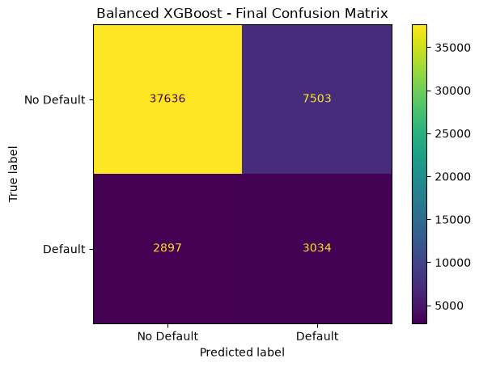
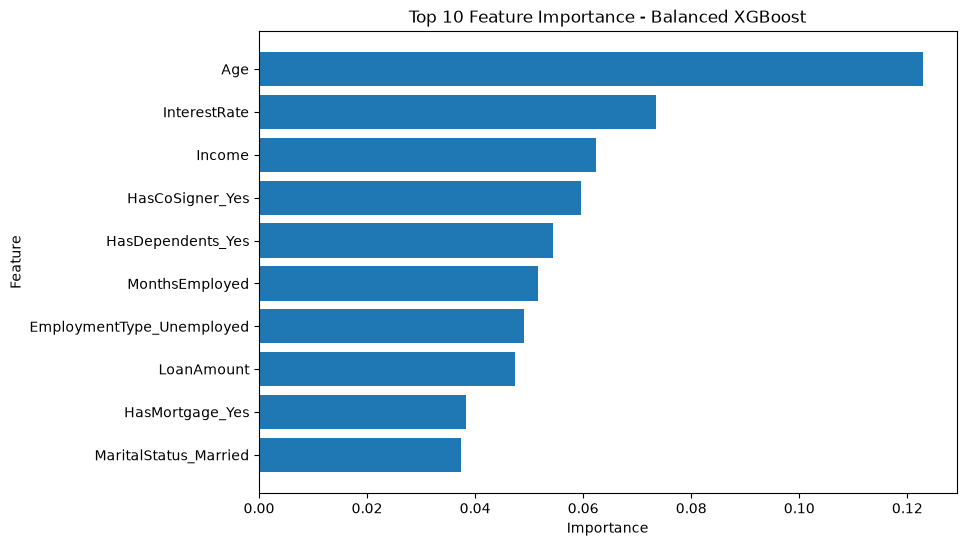
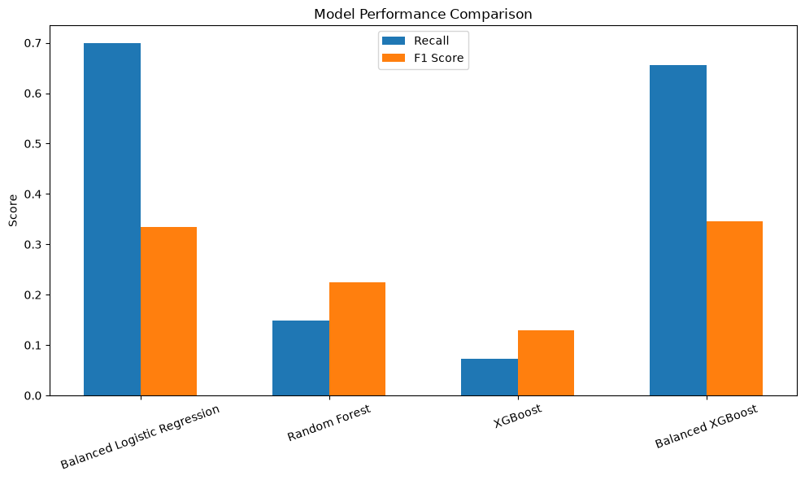

# Bank Loan Default Prediction

## Project Overview

This project predicts whether a bank loan applicant is likely to default on a loan.

The project uses machine learning classification techniques to analyze customer, financial, employment, and loan-related information.

## Dataset

The dataset contains 255,347 loan records and 18 columns.

### Main Features

- Age
- Income
- Loan Amount
- Credit Score
- Months Employed
- Number of Credit Lines
- Interest Rate
- Loan Term
- DTI Ratio
- Education
- Employment Type
- Marital Status
- Mortgage Status
- Dependents
- Loan Purpose
- Co-Signer
- Default

## Data Preparation

The dataset was checked for:

- Missing values
- Duplicate records
- Data types
- Numerical distributions
- Categorical variables
- Class imbalance

Categorical variables were converted using one-hot encoding.

## Machine Learning Models

The following models were evaluated:

1. Logistic Regression
2. Random Forest
3. XGBoost
4. Balanced XGBoost

## Final Model

The selected model is:

**Balanced XGBoost with a classification threshold of 0.6**

### Final Performance

| Metric | Score |
|---|---:|
| Accuracy | 79.64% |
| Precision | 28.79% |
| Recall | 51.15% |
| F1 Score | 36.85% |
| ROC-AUC | 75.32% |

## Feature Importance

The most important features identified by the final XGBoost model include:

- Age
- Interest Rate
- Income
- Co-Signer
- Dependents
- Months Employed
- Employment Type
- Loan Amount
- Mortgage
- Marital Status

## Project Structure

```text
Bank_Loan_Default_Prediction/
│
├── data/
│   ├── raw/
│   └── cleaned/
│
├── models/
│
├── notebooks/
│
├── reports/
│
├── src/
│   └── predict.py
│
├── README.md
└── .gitignore
## Model Results

### Confusion Matrix



### Feature Importance



### Model Comparison

